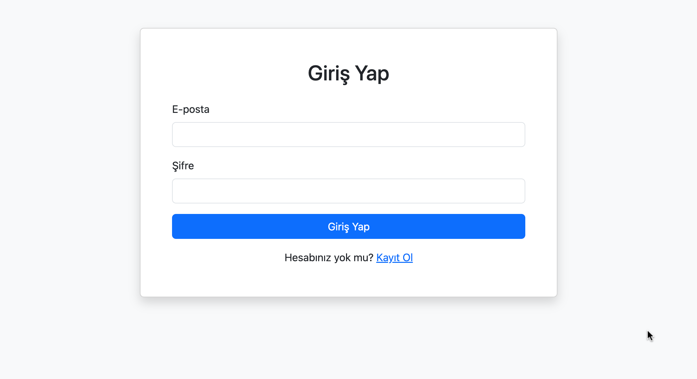
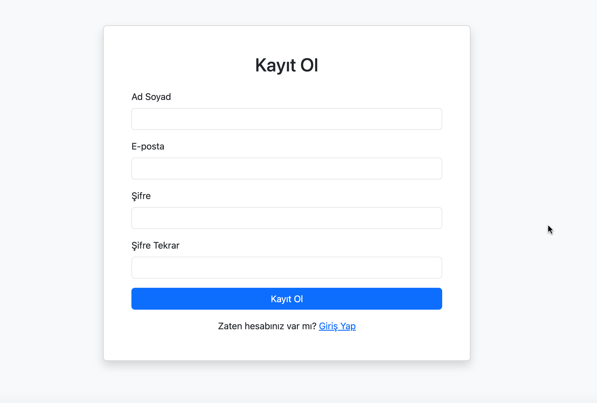
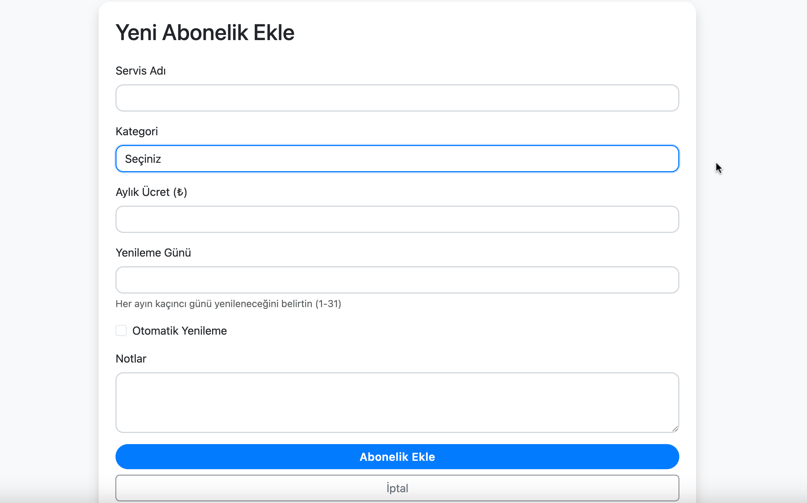
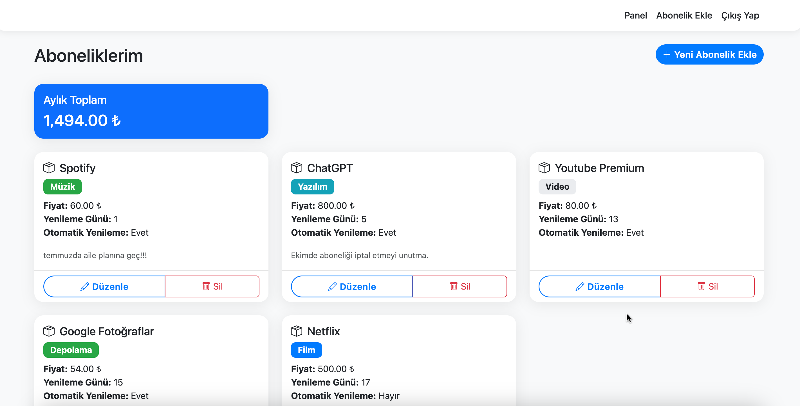

# Abonelik Takip Uygulaması (Subscription Tracker)

Modern web teknolojileri kullanılarak geliştirilmiş, kullanıcıların dijital servis aboneliklerini takip edebilecekleri güvenli ve kullanıcı dostu bir web uygulaması.

## 🎯 Özellikler

### 👤 Kullanıcı Yönetimi
- Güvenli kayıt ve giriş sistemi
- Şifre hashleme ile güvenli depolama
- Oturum yönetimi (PHP Sessions)
- Profil yönetimi

### 📱 Abonelik Yönetimi
- Abonelik ekleme, düzenleme, silme
- Kategori bazlı filtreleme
- Yenileme tarihi takibi
- Otomatik yenileme durumu kontrolü

### 🏷️ Kategoriler
- Streaming (Netflix, Disney+, Prime Video)
- Müzik (Spotify, Apple Music)
- Oyun (Xbox Game Pass, PlayStation Plus)
- Yazılım (Adobe Creative Cloud, Microsoft 365)
- Hosting ve Domain
- Depolama (Google Drive, Dropbox)

## 🛠️ Teknolojiler

- **Backend**: Saf PHP (Framework kullanılmadan)
- **Veritabanı**: MySQL
- **Frontend**: HTML5, CSS3, JavaScript
- **CSS Framework**: Bootstrap 5
- **Güvenlik**: 
  - PDO Prepared Statements
  - Password Hashing
  - Session Management

## 📸 Uygulama Görselleri

### Giriş Ekranı

*Güvenli ve kullanıcı dostu giriş arayüzü*

### Kayıt Ekranı

*Detaylı bilgi girişi ve doğrulama*

### Abonelik Oluşturma

*Kapsamlı kategori ve detay seçenekleri*

### Abonelik Takip

*Filtreleme ve arama özellikleri*

## 🔐 Güvenlik Özellikleri

- SQL injection koruması (PDO Prepared Statements)
- XSS ve CSRF koruması
- Güvenli şifre hashleme (password_hash)
- Session tabanlı oturum yönetimi
- Input validasyonu

## 📊 Veritabanı Yapısı

### Users Tablosu
```sql
CREATE TABLE users (
    id INT AUTO_INCREMENT PRIMARY KEY,
    name VARCHAR(100) NOT NULL,
    email VARCHAR(100) UNIQUE NOT NULL,
    password VARCHAR(255) NOT NULL,
    created_at TIMESTAMP DEFAULT CURRENT_TIMESTAMP
);
```

### Subscriptions Tablosu
```sql
CREATE TABLE subscriptions (
    id INT AUTO_INCREMENT PRIMARY KEY,
    user_id INT NOT NULL,
    service_name VARCHAR(100) NOT NULL,
    category VARCHAR(50),
    price DECIMAL(8,2),
    renewal_day INT,
    auto_renew BOOLEAN DEFAULT 1,
    notes TEXT,
    created_at TIMESTAMP DEFAULT CURRENT_TIMESTAMP,
    FOREIGN KEY (user_id) REFERENCES users(id) ON DELETE CASCADE
);
```

## 📝 Kod Standartları

- PSR-4 autoloading
- PSR-12 kodlama standardı
- Temiz kod prensipleri
- Kapsamlı dokümantasyon

## 🎥 Demo Video

[Demo video bağlantısı buraya eklenecek]

## 🤝 Katkıda Bulunma

1. Fork yapın
2. Feature branch oluşturun (`git checkout -b feature/amazing-feature`)
3. Değişikliklerinizi commit edin (`git commit -m 'feat: Add amazing feature'`)
4. Branch'inizi push edin (`git push origin feature/amazing-feature`)
5. Pull Request oluşturun

## 📋 Kurulum

1. XAMPP'ı bilgisayarınıza kurun
2. MySQL ve Apache servislerini başlatın
3. phpMyAdmin üzerinden `subscription_tracker` adında yeni bir veritabanı oluşturun
4. Projeyi XAMPP'ın htdocs klasörüne kopyalayın
5. Tarayıcınızdan `http://localhost/PHP_MySQL_Projesi` adresine gidin

## 👨‍💻 Geliştirici

